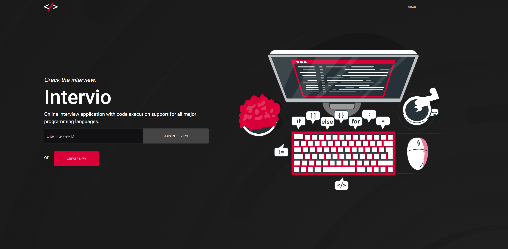
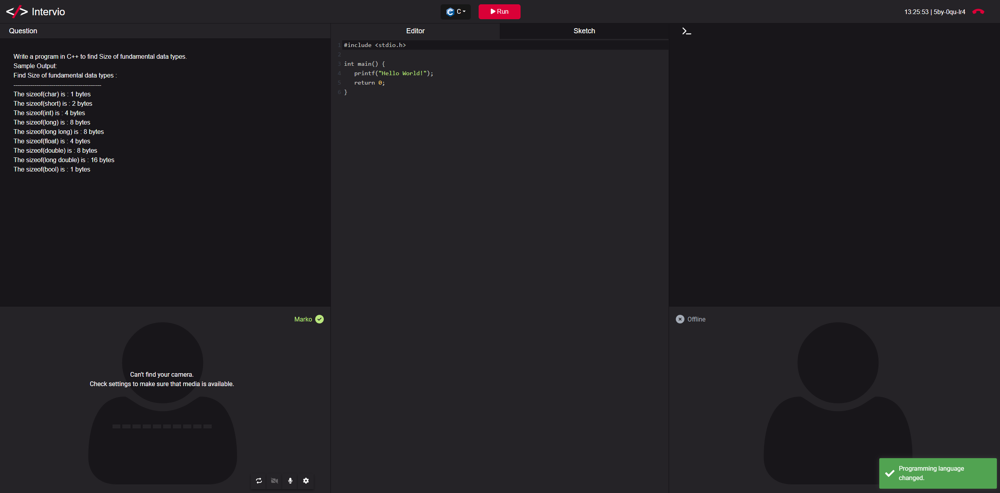

# Intervio
IN DEVELOPMENT

Online interviewing application with support for code execution. Written in .NET and Angular with own implementation of websockets. Application uses WebRTC for peer-to-peer video/audio communication and
signalling server to manage connections, rooms and code execution. Code is executed by calling judge0
API which has to be deployed in order for app to work.

